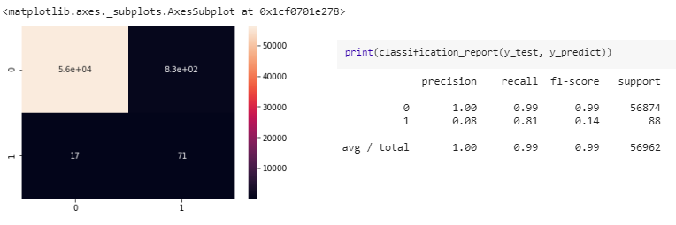
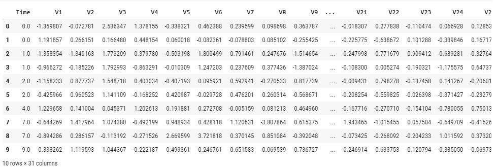
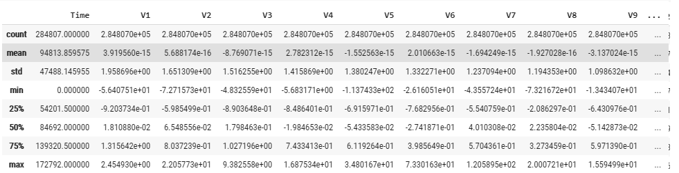
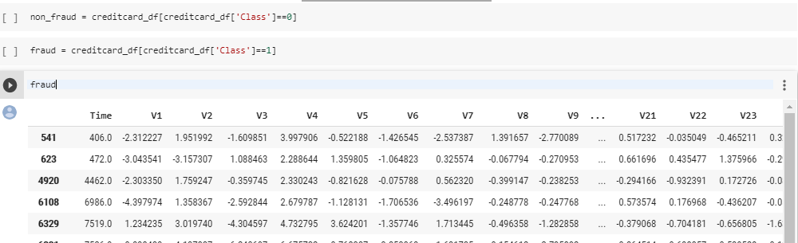
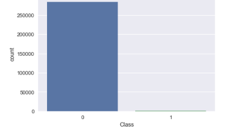
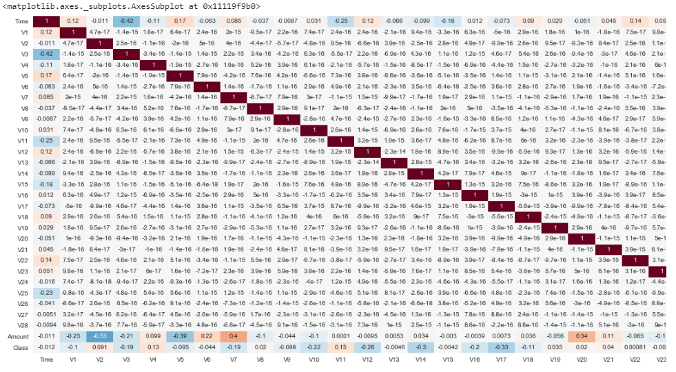
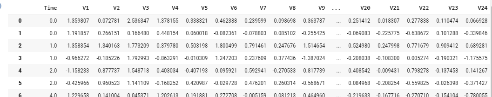
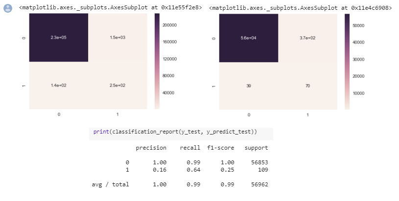

#### Machine Learning - Naive Bayes

# CreditCard--Fraud-Dection

# Background

Credit card companies need to have the ability to recognize fraudulent credit card transactions so that customers are not charged for items that they did not purchase.

Datasets contains transactions made by credit cards in September 2013 by european cardholders. This dataset presents transactions that occurred in two days, where we have 492 frauds out of 284,807 transactions. The dataset is highly unbalanced, the positive class (frauds) account for 0.172% of all transactions.

The data contains only numerical input variables which are the result of a PCA transformation. Unfortunately, due to confidentiality issues, we cannot provide the original features and more background information about the data.

Input Features: V1, V2, ... V28 are the principal components obtained with PCA, the only features which have not been transformed with PCA are 'Time' and 'Amount'. Feature 'Time' contains the seconds elapsed between each transaction and the first transaction in the dataset. The feature 'Amount' is the transaction Amount, this feature can be used for example-dependant cost-senstive learning.

Output: 1 in case of fraud and 0 otherwise.

Link to the dataset: https://www.kaggle.com/mlg-ulb/creditcardfraud/home

# Goals

* Discover insights into consumer reviews and perfrom sentiment analysis on the data.
* Split the data in Train and Test
* Train and Test the model in the data set
* Visualize data
* Get best accuracy 

# How to run 

Open Google Colab https://colab.research.google.com/
* File
* Upload Notebook
* Run the Cells

# Proccess

Import the data set and visualize the data

* Data set
#  

* Visualizing data points
#  

* Visualizing data points
#  

* Histogram (bins=5)
#  

Transforming the data
* Drop collumns
* Apply Dumies at Variation Collumn
* Add the encoded column again
* Concatenate them together

#  

Training Train and Test

#  

Evaluating the model
#  

Improve the model
* Droping the variations and add review length as a feature
* Apply randomforest_classifier
#  

Final Model represented by Confunsion Matrix
#  

